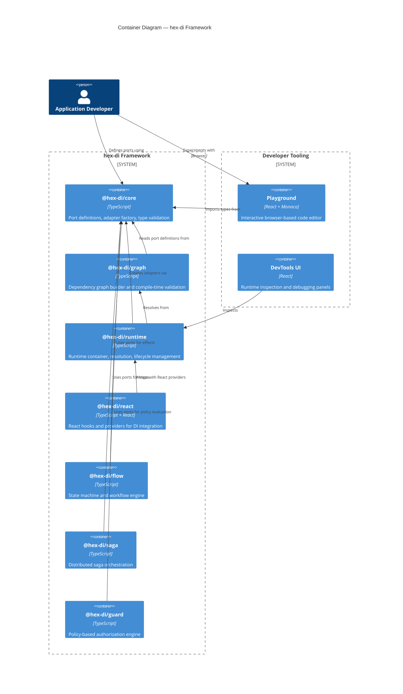
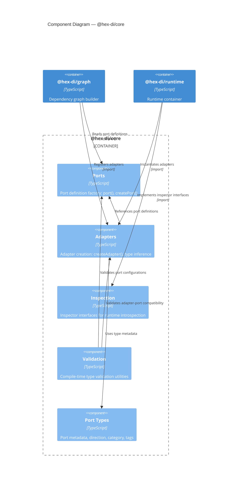
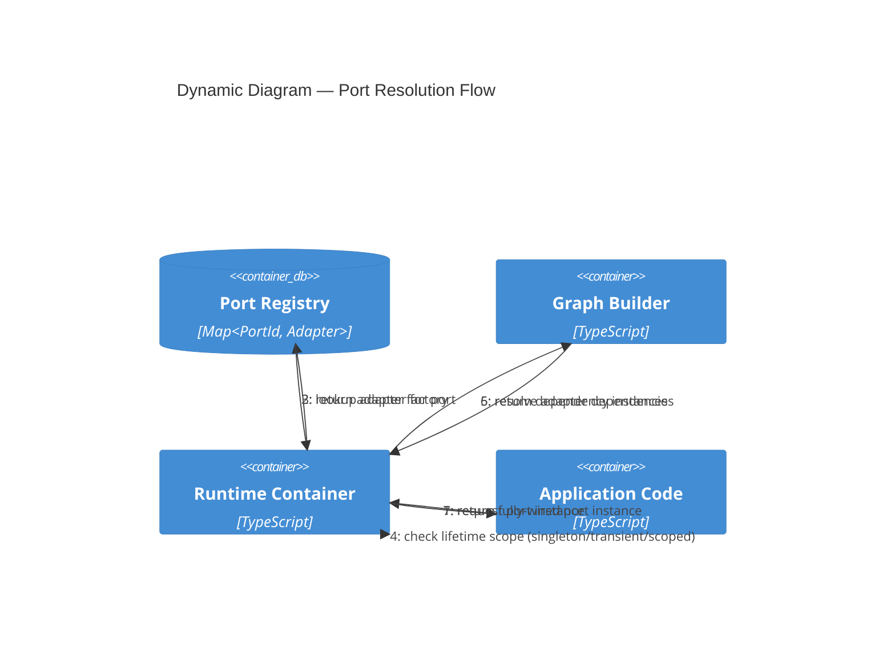
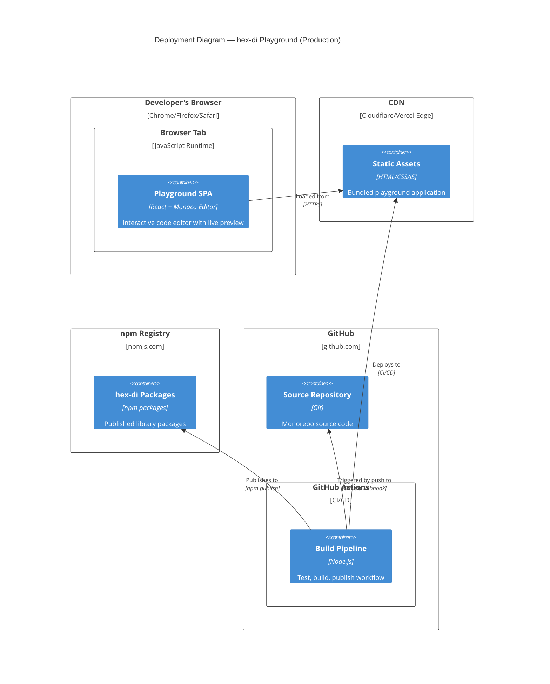
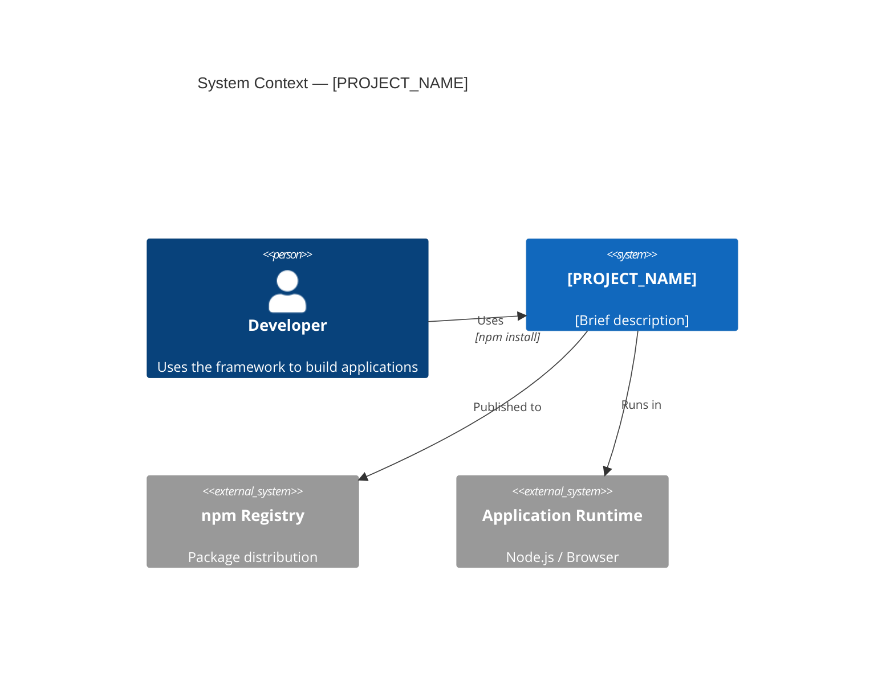
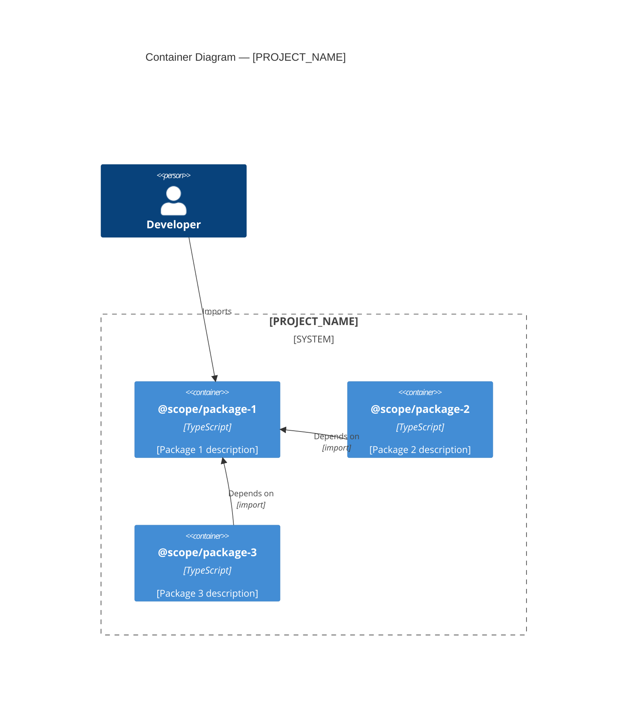
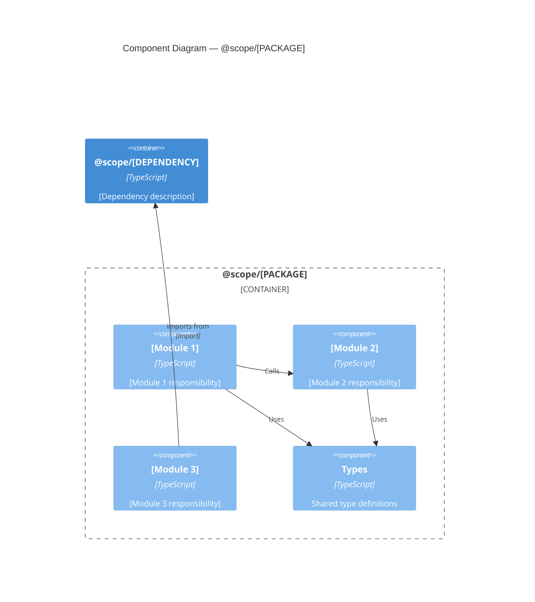
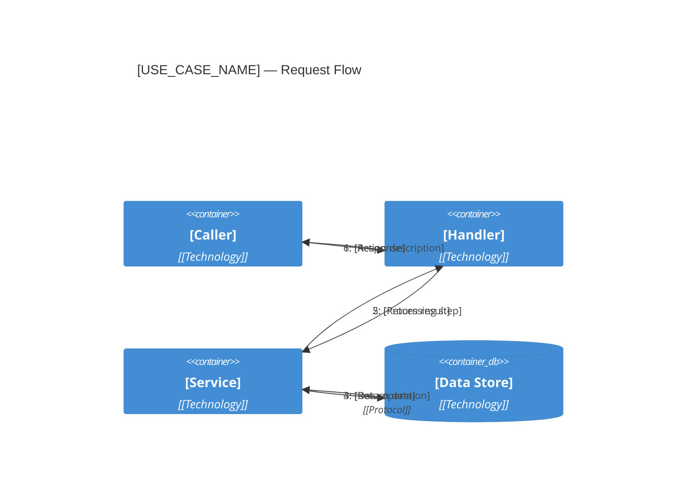
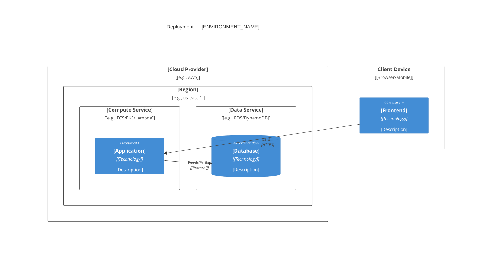

## When to use this skill

- Writing Mermaid C4 diagram code blocks in markdown files
- Looking up the correct macro syntax for C4 elements (Person, System, Container, Component)
- Creating C4Context, C4Container, C4Component, C4Dynamic, or C4Deployment diagrams
- Adding boundaries, relationships, or styling to Mermaid C4 diagrams
- Using ready-to-use templates for common architecture patterns
- Debugging Mermaid C4 rendering issues or syntax errors
- Embedding C4 diagrams in specification documents, READMEs, or ADRs

For C4 methodology guidance (which level to choose, scoping, consistency), use the `c4-methodology` skill instead.


---

# Mermaid C4 Diagram Syntax Reference

Mermaid supports C4 diagrams as an experimental feature, implementing the C4-PlantUML macro syntax. All C4 diagrams are rendered with an auto-generated legend.

## Diagram Types Overview

| Diagram Type | Mermaid Keyword | C4 Level | Purpose |
|-------------|----------------|----------|---------|
| System Context | `C4Context` | C1 | System and its environment |
| Container | `C4Container` | C2 | High-level technical building blocks |
| Component | `C4Component` | C3 | Internal structure of a container |
| Dynamic | `C4Dynamic` | Any | Numbered runtime interactions for a use case |
| Deployment | `C4Deployment` | Infra | Containers mapped to infrastructure nodes |

---

## Element Macros

### Person Macros

```
Person(alias, label, ?descr, ?sprite, ?tags, $link)
Person_Ext(alias, label, ?descr, ?sprite, ?tags, $link)
```

- `Person` — internal user/actor (rendered with blue styling)
- `Person_Ext` — external user/actor (rendered with gray styling)

**Parameters:**
- `alias` (required): Unique identifier used in relationships
- `label` (required): Display name
- `descr`: Description text shown in the element box
- `sprite`, `tags`, `$link`: Optional metadata

### Software System Macros

```
System(alias, label, ?descr, ?sprite, ?tags, $link)
System_Ext(alias, label, ?descr, ?sprite, ?tags, $link)
SystemDb(alias, label, ?descr, ?sprite, ?tags, $link)
SystemDb_Ext(alias, label, ?descr, ?sprite, ?tags, $link)
SystemQueue(alias, label, ?descr, ?sprite, ?tags, $link)
SystemQueue_Ext(alias, label, ?descr, ?sprite, ?tags, $link)
```

- `System` / `System_Ext` — standard software system (internal / external)
- `SystemDb` / `SystemDb_Ext` — database-shaped system
- `SystemQueue` / `SystemQueue_Ext` — queue-shaped system

### Container Macros

Used in C4Container and C4Component diagrams:

```
Container(alias, label, ?techn, ?descr, ?sprite, ?tags, $link)
Container_Ext(alias, label, ?techn, ?descr, ?sprite, ?tags, $link)
ContainerDb(alias, label, ?techn, ?descr, ?sprite, ?tags, $link)
ContainerDb_Ext(alias, label, ?techn, ?descr, ?sprite, ?tags, $link)
ContainerQueue(alias, label, ?techn, ?descr, ?sprite, ?tags, $link)
ContainerQueue_Ext(alias, label, ?techn, ?descr, ?sprite, ?tags, $link)
```

- `Container` / `Container_Ext` — standard container (internal / external)
- `ContainerDb` / `ContainerDb_Ext` — database container (cylinder shape)
- `ContainerQueue` / `ContainerQueue_Ext` — message queue container

**Note:** Container macros include a `techn` (technology) parameter that System macros do not.

### Component Macros

Used in C4Component diagrams:

```
Component(alias, label, ?techn, ?descr, ?sprite, ?tags, $link)
Component_Ext(alias, label, ?techn, ?descr, ?sprite, ?tags, $link)
ComponentDb(alias, label, ?techn, ?descr, ?sprite, ?tags, $link)
ComponentDb_Ext(alias, label, ?techn, ?descr, ?sprite, ?tags, $link)
ComponentQueue(alias, label, ?techn, ?descr, ?sprite, ?tags, $link)
ComponentQueue_Ext(alias, label, ?techn, ?descr, ?sprite, ?tags, $link)
```

Same variants as Container macros but at the component abstraction level.

---

## Boundary Macros

Boundaries group related elements visually with a dashed border:

```
Boundary(alias, label, ?type, ?tags, $link)
Enterprise_Boundary(alias, label, ?tags, $link)
System_Boundary(alias, label, ?tags, $link)
Container_Boundary(alias, label, ?tags, $link)
```

- `Boundary` — generic boundary with optional type label
- `Enterprise_Boundary` — boundary representing an enterprise/organization
- `System_Boundary` — boundary representing a software system (used in C2 diagrams)
- `Container_Boundary` — boundary representing a container (used in C3 diagrams)

**Syntax:** Boundaries use curly braces to contain their children:

```
System_Boundary(alias, "Label") {
    Container(c1, "Container 1")
    Container(c2, "Container 2")
}
```

---

## Relationship Macros

### Standard Relationships

```
Rel(from, to, label, ?techn, ?descr, ?sprite, ?tags, $link)
BiRel(from, to, label, ?techn, ?descr, ?sprite, ?tags, $link)
Rel_Back(from, to, label, ?techn, ?descr, ?sprite, ?tags, $link)
```

- `Rel` — unidirectional relationship (arrow from → to)
- `BiRel` — bidirectional relationship (arrows in both directions)
- `Rel_Back` — reverse relationship (arrow from to → from)

### Directional Relationships (Layout Hints)

These provide layout direction hints to the rendering engine:

```
Rel_U(from, to, label, ?techn, ?descr, ?sprite, ?tags, $link)
Rel_Up(from, to, label, ?techn, ?descr, ?sprite, ?tags, $link)
Rel_D(from, to, label, ?techn, ?descr, ?sprite, ?tags, $link)
Rel_Down(from, to, label, ?techn, ?descr, ?sprite, ?tags, $link)
Rel_L(from, to, label, ?techn, ?descr, ?sprite, ?tags, $link)
Rel_Left(from, to, label, ?techn, ?descr, ?sprite, ?tags, $link)
Rel_R(from, to, label, ?techn, ?descr, ?sprite, ?tags, $link)
Rel_Right(from, to, label, ?techn, ?descr, ?sprite, ?tags, $link)
```

- `Rel_U` / `Rel_Up` — hint: place target above source
- `Rel_D` / `Rel_Down` — hint: place target below source
- `Rel_L` / `Rel_Left` — hint: place target left of source
- `Rel_R` / `Rel_Right` — hint: place target right of source

### Neighbor Relationships

```
Rel_Neighbor(from, to, label, ?techn, ?descr, ?sprite, ?tags, $link)
```

Hint that two elements should be placed adjacent to each other.

### Dynamic Diagram Relationships

```
RelIndex(index, from, to, label, ?techn, ?descr, ?sprite, ?tags, $link)
```

Used in `C4Dynamic` diagrams to show numbered/ordered interactions. The `index` parameter is displayed as a sequence number on the relationship arrow.

---

## Deployment Macros

Used in `C4Deployment` diagrams:

```
Deployment_Node(alias, label, ?type, ?descr, ?sprite, ?tags, $link)
Node(alias, label, ?type, ?descr, ?sprite, ?tags, $link)
Node_L(alias, label, ?type, ?descr, ?sprite, ?tags, $link)
Node_R(alias, label, ?type, ?descr, ?sprite, ?tags, $link)
```

- `Deployment_Node` / `Node` — infrastructure node (server, cloud service, runtime environment)
- `Node_L` — deployment node with left layout hint
- `Node_R` — deployment node with right layout hint

Deployment nodes can be **nested** using curly braces to show infrastructure hierarchy:

```
Deployment_Node(cloud, "AWS", "Cloud") {
    Deployment_Node(region, "us-east-1", "Region") {
        Deployment_Node(ec2, "EC2 Instance", "t3.large") {
            Container(api, "API Server", "Node.js")
        }
    }
}
```

---

## Styling Macros

### Element Styling

```
UpdateElementStyle(elementName, ?bgColor, ?fontColor, ?borderColor, ?shadowing, ?shape, ?sprite, ?techn, ?legendText, ?legendSprite)
```

Override the default style of a specific element type. Parameters:
- `elementName`: The tag or element type to style
- `bgColor`: Background color (hex, e.g., `#438dd5`)
- `fontColor`: Text color
- `borderColor`: Border color
- `shadowing`: Enable/disable shadow (`true`/`false`)
- `shape`: Element shape
- `legendText`: Text shown in the auto-generated legend

### Relationship Styling

```
UpdateRelStyle(from, to, ?textColor, ?lineColor, ?offsetX, ?offsetY)
```

Override the style of a specific relationship. Parameters:
- `from`, `to`: Element aliases identifying the relationship
- `textColor`: Label text color
- `lineColor`: Line/arrow color
- `offsetX`, `offsetY`: Label offset from the default position

### Layout Configuration

```
UpdateLayoutConfig(?c4ShapeInRow, ?c4BoundaryInRow)
```

Control the layout grid:
- `c4ShapeInRow`: Number of C4 shapes (elements) per row
- `c4BoundaryInRow`: Number of boundaries per row

---

## Complete Diagram Examples

### C4Context — System Context Diagram

```mermaid
C4Context
    title System Context Diagram — hex-di Framework

    Person(dev, "Application Developer", "Builds applications using hex-di")
    Person(lib_dev, "Library Author", "Creates adapters and plugins")

    System(hexdi, "hex-di", "TypeScript DI framework with hexagonal architecture")

    System_Ext(npm, "npm Registry", "Package distribution and discovery")
    System_Ext(app_runtime, "Application Runtime", "Node.js or Browser environment")
    System_Ext(ci, "CI/CD Pipeline", "Automated testing and publishing")

    Rel(dev, hexdi, "Uses", "npm install")
    Rel(lib_dev, hexdi, "Extends", "Creates adapters")
    Rel(hexdi, npm, "Published to", "npm publish")
    Rel(hexdi, app_runtime, "Runs in")
    Rel(ci, hexdi, "Builds and tests")

    UpdateLayoutConfig(4, 2)
```

### C4Container — Container Diagram



### C4Component — Component Diagram



### C4Dynamic — Dynamic Diagram



### C4Deployment — Deployment Diagram



---

## Templates

### Template 1: Monorepo System Context

Copy and customize for any monorepo project:



### Template 2: Package Container Diagram

Copy and customize for showing monorepo package structure:



### Template 3: Library Component Diagram

Copy and customize for showing internal modules of a package:



### Template 4: Request Flow Dynamic Diagram

Copy and customize for showing a specific use case:



### Template 5: Cloud Deployment Diagram

Copy and customize for showing deployment topology:



---

## ASCII Format

When producing C4 diagrams for terminal/CLI output rather than markdown, use ASCII box-drawing characters. This format is useful for console output, plain-text documentation, and environments where Mermaid rendering is not available.

### Character Set

| Purpose | Characters |
|---------|-----------|
| Box corners | `┌ ┐ └ ┘` |
| Box sides | `│ ─` |
| Junctions | `├ ┤ ┬ ┴ ┼` |
| Boundary corners | `╔ ╗ ╚ ╝` |
| Boundary sides | `║ ═` |
| Arrows | `▶ ◀ ▼ ▲ ──▶ ◀── │` |

### Layout Rules

1. **Grid alignment**: Align boxes on a consistent grid. Use even spacing between columns.
2. **Width**: Target 80–120 characters wide for terminal readability.
3. **Boundaries**: Use double-line box-drawing (`╔═╗`) for system/container boundaries.
4. **Elements**: Use single-line box-drawing (`┌─┐`) for individual elements.
5. **Labels**: Place relationship labels on or adjacent to the arrow line.
6. **Legend**: Include a `[Legend]` block at the bottom explaining box styles.
7. **Title**: Place the diagram title and type as the first line.

### C1 — System Context

```
  System Context — [System Name]
  ══════════════════════════════

  ┌──────────────────┐
  │   «person»       │
  │  [Actor Name]    │
  └────────┬─────────┘
           │ [relationship]
           ▼
  ╔══════════════════════════════════╗
  ║         [System Name]           ║
  ║  [System description]           ║
  ╚══════════╤═══════════╤══════════╝
             │           │
    [rel label]     [rel label]
             ▼           ▼
  ┌────────────────┐ ┌────────────────┐
  │  «external»    │ │  «external»    │
  │  [Ext System]  │ │  [Ext System]  │
  └────────────────┘ └────────────────┘

  [Legend]
  ╔══╗  Software System
  ┌──┐  Person / External System
  ──▶  Relationship
```

### C2 — Container

```
  Container Diagram — [System Name]
  ═════════════════════════════════

  ╔══════════════════ [System Name] ══════════════════╗
  ║                                                    ║
  ║  ┌──────────────┐    ┌──────────────┐             ║
  ║  │ [Container]  │───▶│ [Container]  │             ║
  ║  │ [Technology] │    │ [Technology] │             ║
  ║  └──────────────┘    └──────┬───────┘             ║
  ║                             │                      ║
  ║                      [rel label]                   ║
  ║                             ▼                      ║
  ║                      ┌──────────────┐             ║
  ║                      │ [Container]  │             ║
  ║                      │ [Technology] │             ║
  ║                      └──────────────┘             ║
  ╚════════════════════════════════════════════════════╝

  [Legend]
  ╔══╗  System boundary
  ┌──┐  Container
  ──▶  Dependency (with label)
```

### C3 — Component

```
  Component Diagram — [Container Name]
  ════════════════════════════════════

  ╔═════════════════ [Container Name] ═════════════════╗
  ║                                                     ║
  ║  ┌─────────────┐  ┌─────────────┐                  ║
  ║  │ [Component] │──│ [Component] │                  ║
  ║  │ [Techn]     │  │ [Techn]     │                  ║
  ║  └──────┬──────┘  └─────────────┘                  ║
  ║         │                                           ║
  ║    [rel label]                                      ║
  ║         ▼                                           ║
  ║  ┌─────────────┐                                    ║
  ║  │ [Component] │                                    ║
  ║  │ [Techn]     │                                    ║
  ║  └─────────────┘                                    ║
  ╚═════════════════════════════════════════════════════╝

  [Legend]
  ╔══╗  Container boundary
  ┌──┐  Component
  ──▶  Dependency
```

---

## Known Limitations

1. **Experimental status**: Mermaid C4 support is marked as experimental. Syntax may change between Mermaid versions.

2. **Limited layout control**: Auto-layout sometimes produces suboptimal element placement. Use directional relationship macros (`Rel_D`, `Rel_R`, etc.) and `UpdateLayoutConfig` to influence layout.

3. **No sprite support in all renderers**: The `sprite` parameter may not render in all Mermaid environments (e.g., GitHub markdown rendering).

4. **Legend always shown**: The auto-generated legend cannot be hidden. It adds vertical space to every diagram.

5. **Boundary nesting limits**: Deeply nested boundaries (3+ levels) can cause rendering issues in some Mermaid versions.

6. **Link parameter**: The `$link` parameter generates clickable elements, but this only works in interactive Mermaid renderers, not in static markdown previews.

7. **Tag-based styling**: The `tags` parameter on elements is supported syntactically but has limited styling integration compared to C4-PlantUML.

8. **No filtered views**: Mermaid C4 has no mechanism to create filtered views from a single model. Each diagram is standalone.

9. **Rendering differences**: Mermaid C4 may render differently across GitHub, GitLab, VS Code, and other markdown renderers. Test in your target environment.
