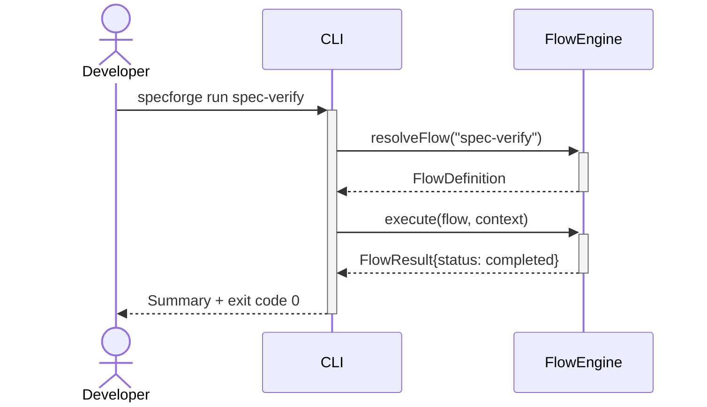
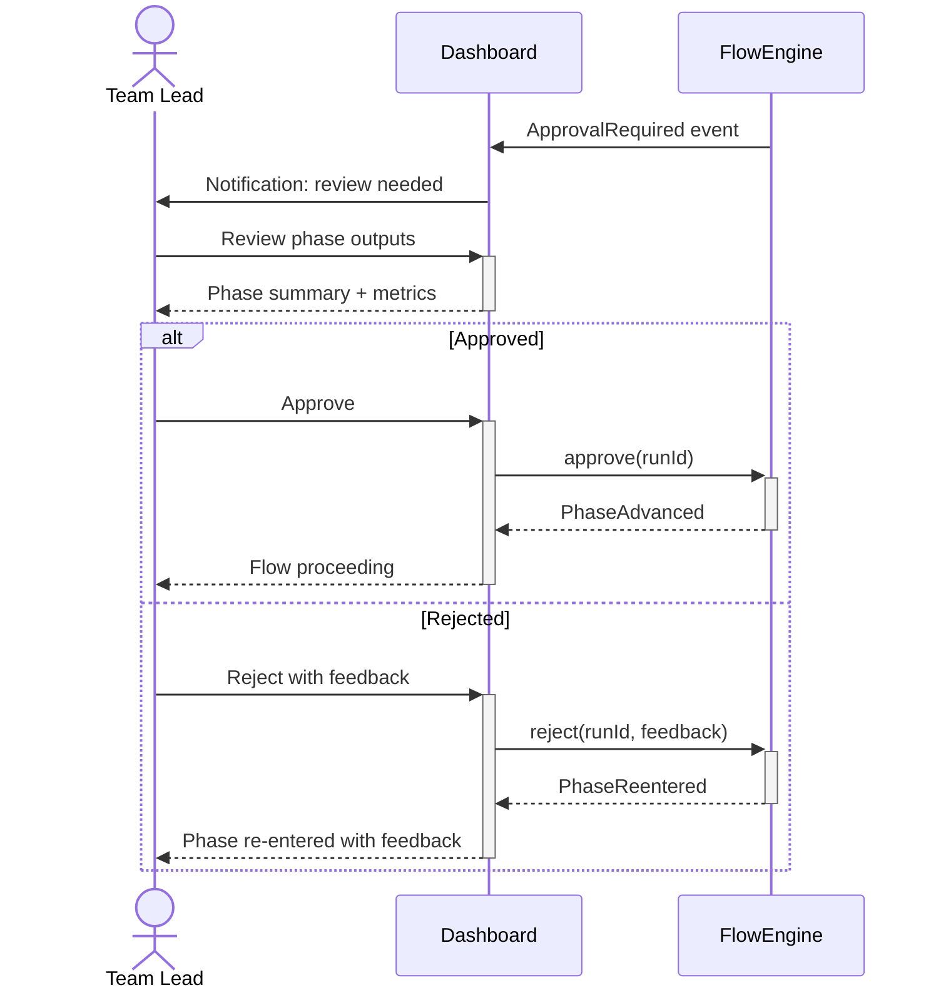
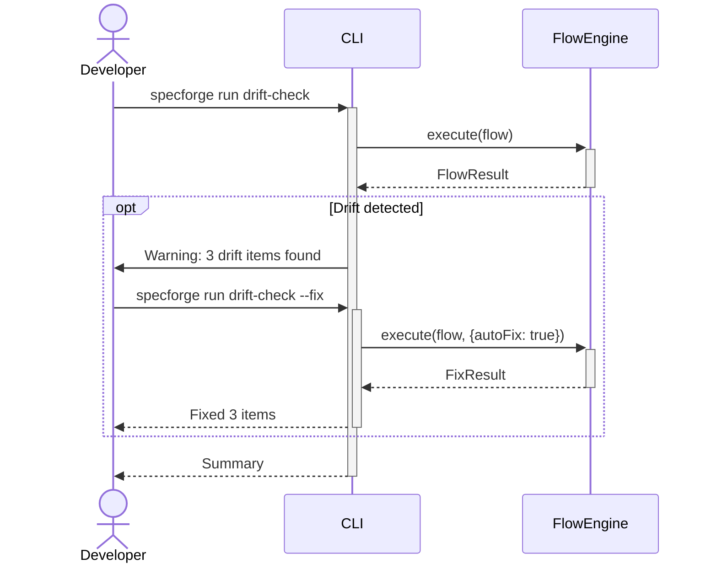
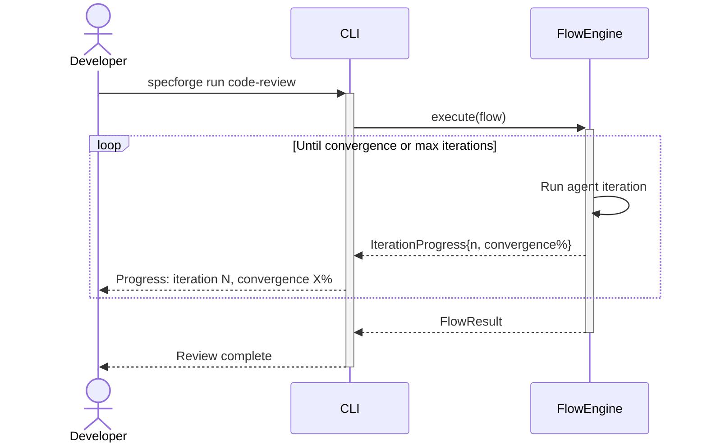
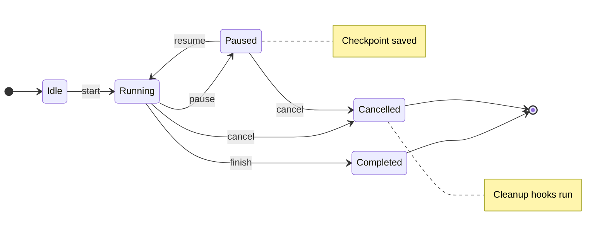
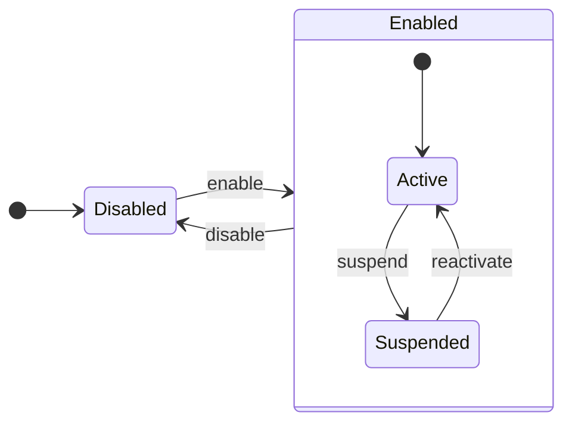
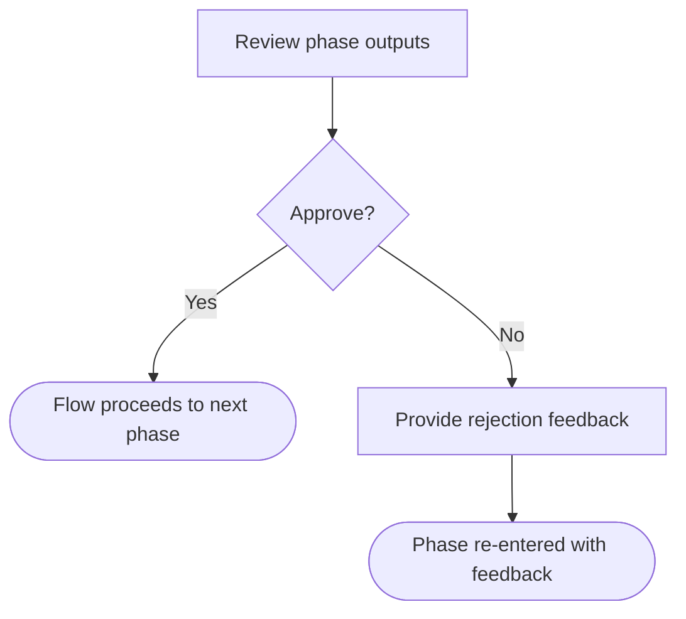
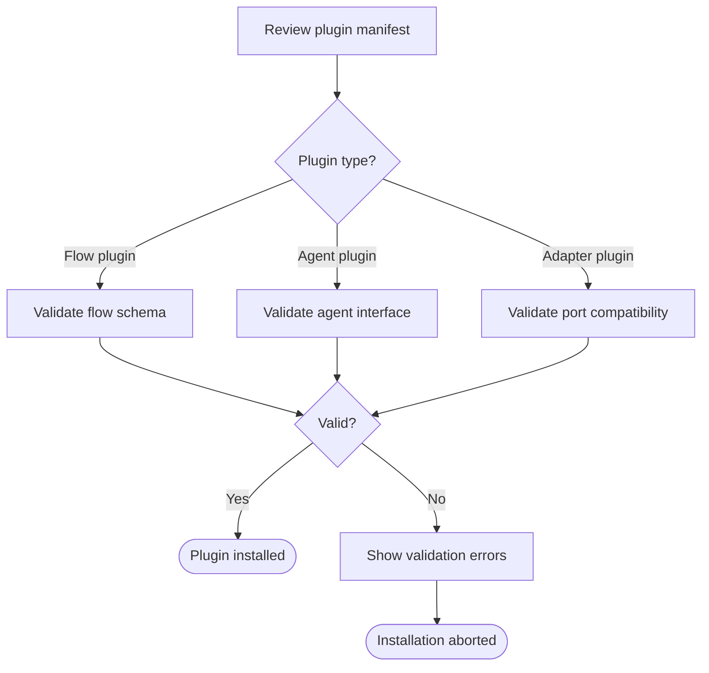

# Diagram Selection Reference

Guide for choosing and authoring Mermaid diagrams in capability specification files.

## Diagram Type Selection Matrix

| Capability Pattern | Diagrams Required | Detection Heuristic | Examples |
|---|---|---|---|
| **Simple CLI command** | Sequence only | Single linear path, no branching, no state changes | Run a flow, list items, export data |
| **Dashboard / monitoring** | Sequence only | Read-only views, no user decisions | View history, monitor health, inspect logs |
| **Stateful lifecycle** | Sequence + State | Steps mention pause/resume/cancel, activate/deactivate, or multiple statuses | Pause/resume flow, enable/disable plugin, activate compliance mode |
| **Branching decision** | Sequence + Decision Flowchart | Steps contain approve/reject, if/then, or alternative paths | Approve phase transition, review and accept/reject, choose route |
| **Multi-step chain** | Sequence + Related Capabilities table | Capability references or depends on other capabilities | Onboarding wizard, multi-phase setup |

### Decision Tree

```
Does the capability involve state changes (pause/resume/cancel/activate)?
├── Yes → Include State Diagram
│         Does it also involve user decisions (approve/reject)?
│         ├── Yes → Sequence + State + Flowchart (rare, all three)
│         └── No  → Sequence + State
└── No  → Does it involve user decisions (approve/reject/if-then)?
          ├── Yes → Sequence + Flowchart
          └── No  → Sequence only
```

## Mermaid Syntax Patterns

### Sequence Diagram — Simple Linear Flow

```text
┌───────────┐    ┌─────┐    ┌────────────┐
│ Developer │    │ CLI │    │ FlowEngine │
└─────┬─────┘    └──┬──┘    └─────┬──────┘
      │  run cmd    │             │
      │────────────►│  resolve    │
      │             │────────────►│
      │             │  FlowDef    │
      │             │◄────────────│
      │             │  execute    │
      │             │────────────►│
      │             │  result     │
      │  summary    │◄────────────│
      │◄────────────│             │
```



**Key patterns:**
- `actor` for the primary persona
- `participant X as Label` for aliased names
- `->>+` and `-->>-` for activation spans (shows processing time)
- Solid arrows (`->>`) for requests, dashed arrows (`-->>`) for responses

### Sequence Diagram — With Branching (alt/else)

```text
┌───────────┐    ┌───────────┐    ┌────────────┐
│ Team Lead │    │ Dashboard │    │ FlowEngine │
└─────┬─────┘    └─────┬─────┘    └─────┬──────┘
      │                │  Approval       │
      │                │◄────────────────│
      │  notification  │                 │
      │◄───────────────│                 │
      │  review        │                 │
      │───────────────►│                 │
      │  summary       │                 │
      │◄───────────────│                 │
      │                │                 │
      │  [if approved] │                 │
      │  approve       │                 │
      │───────────────►│  approve        │
      │                │────────────────►│
      │                │  PhaseAdvanced  │
      │  proceeding    │◄────────────────│
      │◄───────────────│                 │
      │                │                 │
      │  [if rejected] │                 │
      │  reject        │                 │
      │───────────────►│  reject         │
      │                │────────────────►│
      │                │  PhaseReentered │
      │  re-entered    │◄────────────────│
      │◄───────────────│                 │
```



**Key patterns:**
- `alt`/`else`/`end` for mutually exclusive paths
- Each branch represents a user decision

### Sequence Diagram — With Optional Steps (opt)

```text
┌───────────┐    ┌─────┐    ┌────────────┐
│ Developer │    │ CLI │    │ FlowEngine │
└─────┬─────┘    └──┬──┘    └─────┬──────┘
      │  run cmd    │             │
      │────────────►│  execute    │
      │             │────────────►│
      │             │  result     │
      │             │◄────────────│
      │             │             │
      │  [opt: drift detected]    │
      │  warning     │            │
      │◄─────────────│            │
      │  run --fix   │            │
      │─────────────►│  execute   │
      │              │───────────►│
      │              │  FixResult │
      │  fixed 3     │◄───────────│
      │◄─────────────│            │
      │  [end opt]   │            │
      │              │            │
      │  summary     │            │
      │◄─────────────│            │
```



### Sequence Diagram — With Loops

```text
┌───────────┐    ┌─────┐    ┌────────────┐
│ Developer │    │ CLI │    │ FlowEngine │
└─────┬─────┘    └──┬──┘    └─────┬──────┘
      │  run cmd    │             │
      │────────────►│  execute    │
      │             │────────────►│
      │             │             │
      │  [loop: until convergence]│
      │             │  progress   │
      │  progress   │◄────────────│
      │◄────────────│             │
      │  [end loop] │             │
      │             │             │
      │             │  result     │
      │  complete   │◄────────────│
      │◄────────────│             │
```



### State Diagram — Lifecycle States

```text
                                  · Checkpoint saved
         start       pause       ·
[*] ───► Idle ───► Running ───► Paused
                     │  │           │
                     │  │  cancel   │ cancel
                     │  └─────┐     │
                     │ finish │     │
                     ▼        ▼     ▼
                 Completed  Cancelled
                     │          │  · Cleanup hooks run
                     ▼          ▼
                    [*]        [*]
```



**Key patterns:**
- `direction LR` for left-to-right layout
- `[*]` for initial and final pseudo-states
- `note right of State: text` for guard conditions or clarifications
- State names match the statuses referenced in Steps

### State Diagram — Nested States

```text
                  enable
[*] ───► Disabled ─────► Enabled
                         │ disable
                         │◄──────┐
                         │       │
                    ┌────────────────┐
                    │  [*] ──► Active │
                    │    suspend ↓ ↑  │
                    │   Suspended ──┘ │
                    │    reactivate   │
                    └────────────────┘
```



### Decision Flowchart — Binary Choice

```text
┌───────────────────────┐
│ Review phase outputs  │
└───────────┬───────────┘
            ▼
      ┌──────────┐
     ╱  Approve?  ╲
    ╱              ╲
 Yes                No
  │                  │
  ▼                  ▼
┌──────────────┐  ┌────────────────────────┐
│ Flow proceeds│  │ Provide rejection      │
│ to next phase│  │ feedback               │
└──────────────┘  └───────────┬────────────┘
                              ▼
                  ┌────────────────────────┐
                  │ Phase re-entered       │
                  │ with feedback          │
                  └────────────────────────┘
```



**Key patterns:**
- `flowchart TD` for top-down layout
- `{Decision}` diamond for user choices
- `([Outcome])` stadium shape for terminal outcomes
- `[Action]` rectangle for intermediate steps
- Edge labels with `|Label|` syntax

### Decision Flowchart — Multi-Branch

```text
┌──────────────────────────┐
│ Review plugin manifest   │
└────────────┬─────────────┘
             ▼
     ┌───────────────┐
    ╱  Plugin type?   ╲
   ╱                   ╲
  ╱         │           ╲
Flow      Agent       Adapter
  │         │           │
  ▼         ▼           ▼
┌────────┐┌──────────┐┌────────────┐
│Validate││ Validate ││  Validate  │
│flow    ││ agent    ││  port      │
│schema  ││ iface    ││  compat    │
└───┬────┘└────┬─────┘└─────┬──────┘
    └──────────┼────────────┘
               ▼
         ┌──────────┐
        ╱   Valid?   ╲
       ╱              ╲
    Yes                No
     │                  │
     ▼                  ▼
┌────────────┐  ┌────────────────────┐
│  Plugin    │  │ Show validation    │
│  installed │  │ errors             │
└────────────┘  └─────────┬──────────┘
                          ▼
                ┌────────────────────┐
                │ Installation       │
                │ aborted            │
                └────────────────────┘
```



## Persona and Surface Conventions

### Persona Names (use in `actor` declarations)

| Persona | Mermaid Actor | Description |
|---------|--------------|-------------|
| `developer` | `actor Dev as Developer` | Individual contributor using CLI/IDE |
| `team-lead` | `actor Lead as Team Lead` | Reviewer, approver, team manager |
| `platform-admin` | `actor Admin as Platform Admin` | System configuration, org-level settings |
| `ci-bot` | `actor CI as CI Pipeline` | Automated pipeline agent |

### Surface Names (use in `participant` declarations)

| Surface | Mermaid Participant | Description |
|---------|-------------------|-------------|
| `cli` | `participant CLI` | Command-line interface |
| `dashboard` | `participant Dash as Dashboard` | Web dashboard UI |
| `desktop` | `participant App as Desktop App` | Desktop application |
| `ide` | `participant IDE as IDE Extension` | Editor/IDE integration |
| `api` | `participant API as REST API` | External API surface |

### Backend Component Names

Name backend participants after the actual system component:

```
participant Engine as FlowEngine
participant Store as GraphStore
participant Agent as AgentBackend
participant Registry as FlowRegistry
participant Scheduler as TaskScheduler
```

## ASCII Conventions

Every `mermaid` code block MUST be preceded by an equivalent `text` code block using Unicode box-drawing characters. This ensures readability in plain-text contexts (terminals, git diffs, non-rendering editors).

### Box-Drawing Characters

| Character | Usage |
|-----------|-------|
| `─` | Horizontal lines, arrow shafts |
| `│` | Vertical lines, lifelines |
| `┌ ┐ └ ┘` | Box corners |
| `►` | Request arrow tip (right) |
| `◄` | Response arrow tip (left) |
| `▼` | Downward arrow tip |
| `▲` | Upward arrow tip |
| `╱ ╲` | Diamond approximation for decisions |
| `·` | Dotted lines for async / notes |

### Sequence Diagram Pattern

```text
┌──────────┐    ┌──────┐    ┌────────────┐
│ Persona  │    │ CLI  │    │  Backend   │
└────┬─────┘    └──┬───┘    └─────┬──────┘
     │  action     │              │
     │────────────►│  operation   │
     │             │─────────────►│
     │             │  response    │
     │  feedback   │◄─────────────│
     │◄────────────│              │
```

### State Diagram Pattern

```text
         start       pause
[*] ───► Idle ───► Running ───► Paused
                     │              │
                     │ finish       │ resume
                     ▼              └───► Running
                  Completed ───► [*]
```

### Flowchart Pattern

```text
┌─────────────────┐
│ Action step     │
└────────┬────────┘
         ▼
   ┌──────────┐
  ╱  Decision? ╲
 ╱              ╲
Yes              No
 │                │
 ▼                ▼
┌──────────┐  ┌──────────┐
│ Outcome A│  │ Outcome B│
└──────────┘  └──────────┘
```

### Rules

1. Place `text` block immediately before the corresponding `mermaid` block
2. Keep width under 80 characters where possible
3. Match the content of the Mermaid diagram — same participants, messages, states
4. Use `[if condition]` / `[else]` labels for alt/else branches in sequences
5. Use `[opt: condition]` / `[end opt]` for optional blocks
6. Use `[loop: condition]` / `[end loop]` for loop blocks
