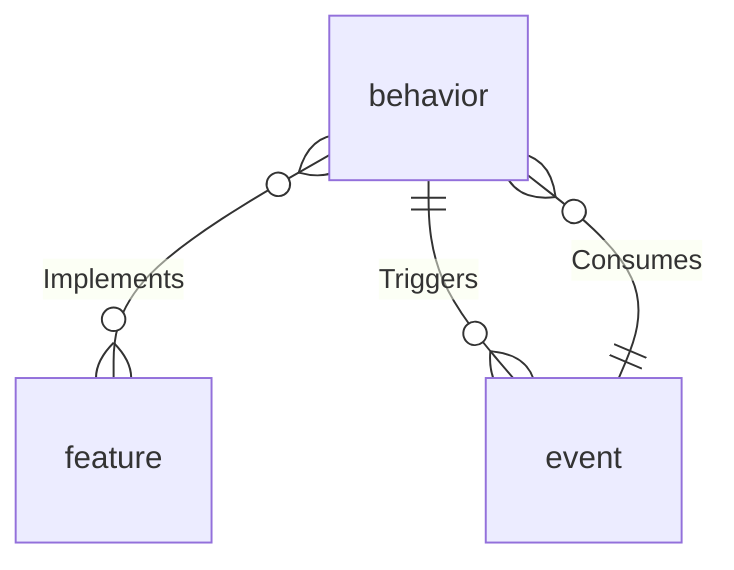
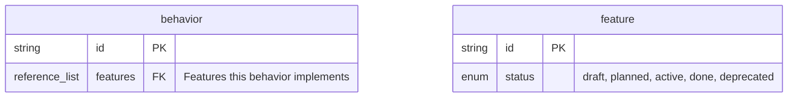
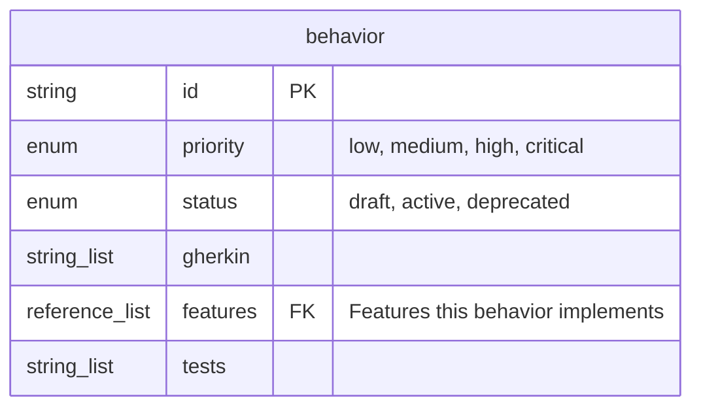

# Field Display Tiers

`specforge model` supports three field detail levels via `--fields=none|keys|all`. The default is `keys`.

All tiers show full field metadata (type, description, enum values, default) — the tier controls **which fields** are included, not how much detail each field shows.

---

## `--fields=none` — Topology View

Shows only entity kind names and relationships. No fields at all. Useful for a high-level overview of how entity kinds connect.

### Markdown example

```markdown
### behavior (@specforge/software)

**Relationships:**
- behavior --(Implements)--> feature [N:M]
- behavior --(Triggers)--> event [1:N]
```

### Mermaid example



### DOT example

```dot
behavior [label=<
  <table border="1" cellborder="0" cellspacing="0">
    <tr><td bgcolor="#4a90d9"><font color="white"><b>behavior</b></font></td></tr>
  </table>
>];
```

---

## `--fields=keys` (default) — Structural View

Shows the synthetic `id` primary key, all required fields, and all reference/reference_list fields (the "foreign keys"). These are the fields that define the structure and relationships of the model.

### Which fields qualify as "keys"

A field is included at the `keys` level if any of these are true:
- It is the synthetic `id` field (always included, marked as PK)
- `field.required == true`
- `field.field_type` is `reference` or `reference_list`

### Markdown example

```markdown
### behavior (@specforge/software)

| Field | Type | Required | Description | Enum Values |
|-------|------|----------|-------------|-------------|
| id | string | yes | Entity identifier | |
| features | reference_list(feature) | no | Features this behavior implements | |
| gherkin | string_list | no | BDD scenario files | |

**Relationships:**
- behavior --(Implements)--> feature [N:M]
- behavior --(Triggers)--> event [1:N]
```

Note: `gherkin` is a `string_list` with `file_reference=true`, which makes it a structural field (it's a test evidence link). Whether to include `file_reference` fields at the `keys` level is an implementation choice — the default is to include reference and reference_list types only. File-reference string_list fields are included at `all` level.

### Mermaid example



---

## `--fields=all` — Complete View

Shows every field declared on the entity kind, with full metadata.

### Markdown example

```markdown
### behavior (@specforge/software)

| Field | Type | Required | Description | Enum Values | Default |
|-------|------|----------|-------------|-------------|---------|
| id | string | yes | Entity identifier | | |
| priority | enum | no | Priority level | low, medium, high, critical | |
| status | enum | no | Lifecycle status | draft, active, deprecated | |
| gherkin | string_list | no | BDD scenario files | | |
| features | reference_list(feature) | no | Features this behavior implements | | |
| tests | string_list | no | Test file references | | |

**Relationships:**
- behavior --(Implements)--> feature [N:M]
- behavior --(Triggers)--> event [1:N]
```

### Mermaid example



### DOT example

```dot
behavior [label=<
  <table border="1" cellborder="0" cellspacing="0">
    <tr><td bgcolor="#4a90d9" colspan="3"><font color="white"><b>behavior</b></font></td></tr>
    <tr><td align="left"><b>id</b></td><td>string</td><td>PK</td></tr>
    <tr><td align="left">priority</td><td>enum</td><td></td></tr>
    <tr><td align="left">status</td><td>enum</td><td></td></tr>
    <tr><td align="left">gherkin</td><td>string_list</td><td></td></tr>
    <tr><td align="left">features</td><td>reference_list</td><td>-> feature</td></tr>
    <tr><td align="left">tests</td><td>string_list</td><td></td></tr>
  </table>
>];
```

---

## Tier interaction with formats

All five formats (Markdown, Mermaid, DOT, JSON, DBML) respect the `--fields` flag:

| Format | `none` | `keys` | `all` |
|--------|--------|--------|-------|
| Markdown | No field table, relationships only | Field table with PK + required + refs | Full field table |
| Mermaid | Entity names only, no `{ }` block | PK + required + ref fields in block | All fields in block |
| DOT | Header-only table node | Header + key field rows | Header + all field rows |
| JSON | `"fields": []` empty array | Only PK + required + ref fields | All fields |
| DBML | Table with only `id` column | `id` + required + ref columns | All columns |
