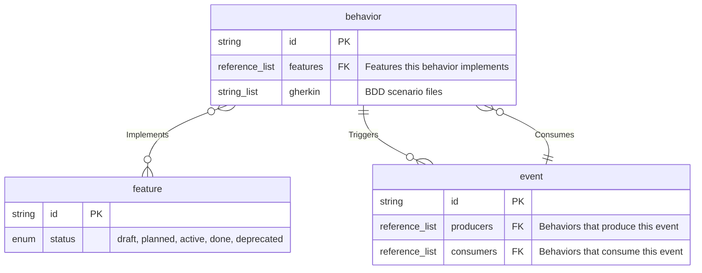

# Model Output Formats

All examples use the same three entity kinds for consistency:

- **behavior** (@specforge/software) — fields: priority (enum), status (enum), gherkin (string_list, file_reference), features (reference_list -> feature), tests (string_list)
- **feature** (@specforge/product) — fields: status (enum, required), priority (enum), effort (enum)
- **event** (@specforge/software) — fields: producers (reference_list -> behavior), consumers (reference_list -> behavior)

Edge types:
- **Implements**: behavior -> feature (N:M, via `features` field)
- **Triggers**: behavior -> event (1:N, via `produces` field)
- **Consumes**: event -> behavior (1:N, via `consumers` field)

All examples shown at `--fields=keys` level with `--group-by=extension`.

---

## Markdown (default)

The Markdown format is designed for both terminal readability and LLM consumption. It includes a framing preamble so an LLM encountering the output for the first time has context.

```markdown
# Logical Data Model

## How to read this model

This document describes the **schema** of a SpecForge project — the entity kinds
(analogous to database tables), their fields (columns), and the relationships
(foreign keys) between them. It does NOT show actual entity instances. Entity
kinds and fields are declared by SpecForge extensions. Relationships have
cardinality: 1:1 (one-to-one), 1:N (one-to-many), N:1 (many-to-one), or
N:M (many-to-many).

## Extensions

| Extension | Version | Entity Kinds | Edge Types |
|-----------|---------|-------------|------------|
| @specforge/software | 1.0.0 | 5 | 10 |
| @specforge/product | 1.0.0 | 9 | 16 |

## @specforge/software

### behavior

| Field | Type | Required | Description | Enum Values |
|-------|------|----------|-------------|-------------|
| id | string | yes | Entity identifier | |
| features | reference_list(feature) | no | Features this behavior implements | |
| gherkin | string_list | no | BDD scenario files | |

**Relationships:**
- behavior --(Implements)--> feature [N:M]
- behavior --(Triggers)--> event [1:N]

### event

| Field | Type | Required | Description | Enum Values |
|-------|------|----------|-------------|-------------|
| id | string | yes | Entity identifier | |
| producers | reference_list(behavior) | no | Behaviors that produce this event | |
| consumers | reference_list(behavior) | no | Behaviors that consume this event | |

**Relationships:**
- event --(Consumes)--> behavior [1:N]

## @specforge/product

### feature

| Field | Type | Required | Description | Enum Values |
|-------|------|----------|-------------|-------------|
| id | string | yes | Entity identifier | |
| status | enum | yes | Lifecycle status | draft, planned, active, done, deprecated |

**Relationships:**
- feature <--(Implements)-- behavior [N:M]

## Summary

3 entity kinds, 3 edge types across 2 extensions.
```

### Key characteristics

- Framing preamble explains what the model is
- Extension summary table at the top
- Grouped by extension with `##` headers
- Field tables include all metadata columns
- Relationships listed per entity with cardinality
- Summary counts at the bottom

---

## Mermaid erDiagram



### Cardinality notation

| Cardinality | Mermaid syntax | Meaning |
|-------------|---------------|---------|
| 1:1 | `\|\|--\|\|` | Exactly one on each side |
| 1:N | `\|\|--o{` | One source, many targets |
| N:1 | `}o--\|\|` | Many sources, one target |
| N:M | `}o--o{` | Many on both sides |

### Extension grouping

Extensions are separated by `%% @extension-name` comment headers. Mermaid erDiagram does not have native namespace support, so comments serve as visual separators.

---

## DOT (Graphviz)

```dot
digraph model {
  rankdir=LR;
  node [shape=none, fontname="Helvetica"];
  edge [fontname="Helvetica", fontsize=10];

  subgraph cluster_software {
    label="@specforge/software";
    style=dashed;
    color="#4a90d9";

    behavior [label=<
      <table border="1" cellborder="0" cellspacing="0">
        <tr><td bgcolor="#4a90d9" colspan="3"><font color="white"><b>behavior</b></font></td></tr>
        <tr><td align="left"><b>id</b></td><td>string</td><td>PK</td></tr>
        <tr><td align="left">features</td><td>reference_list</td><td>-> feature</td></tr>
        <tr><td align="left">gherkin</td><td>string_list</td><td></td></tr>
      </table>
    >];

    event [label=<
      <table border="1" cellborder="0" cellspacing="0">
        <tr><td bgcolor="#4a90d9" colspan="3"><font color="white"><b>event</b></font></td></tr>
        <tr><td align="left"><b>id</b></td><td>string</td><td>PK</td></tr>
        <tr><td align="left">producers</td><td>reference_list</td><td>-> behavior</td></tr>
        <tr><td align="left">consumers</td><td>reference_list</td><td>-> behavior</td></tr>
      </table>
    >];
  }

  subgraph cluster_product {
    label="@specforge/product";
    style=dashed;
    color="#2ecc71";

    feature [label=<
      <table border="1" cellborder="0" cellspacing="0">
        <tr><td bgcolor="#2ecc71" colspan="3"><font color="white"><b>feature</b></font></td></tr>
        <tr><td align="left"><b>id</b></td><td>string</td><td>PK</td></tr>
        <tr><td align="left"><b>status</b></td><td>enum</td><td></td></tr>
      </table>
    >];
  }

  behavior -> feature [label="Implements\n[N:M]"];
  behavior -> event [label="Triggers\n[1:N]"];
  event -> behavior [label="Consumes\n[1:N]"];
}
```

### Key characteristics

- HTML-like `<table>` labels for full control over layout
- Header row colored by extension (blue `#4a90d9` for software, green `#2ecc71` for product)
- Required fields bolded
- Reference fields show `-> target_entity` marker
- Extension grouping via `subgraph cluster_*` with dashed borders
- Edge labels include relationship name and cardinality

### Extension color palette

| Extension | Color |
|-----------|-------|
| @specforge/software | `#4a90d9` (blue) |
| @specforge/product | `#2ecc71` (green) |
| @specforge/governance | `#e74c3c` (red) |
| @specforge/formal | `#9b59b6` (purple) |
| Other | `#95a5a6` (gray) |

Colors are assigned deterministically by extension name hash when unknown.

---

## JSON (ERD-oriented)

```json
{
  "model_version": "1.0.0",
  "extensions": [
    { "name": "@specforge/software", "version": "1.0.0", "entity_count": 5, "edge_count": 10 },
    { "name": "@specforge/product", "version": "1.0.0", "entity_count": 9, "edge_count": 16 }
  ],
  "entities": [
    {
      "name": "behavior",
      "extension": "@specforge/software",
      "fields": [
        { "name": "id", "type": "string", "required": true, "primary_key": true },
        { "name": "features", "type": "reference_list", "required": false, "primary_key": false, "references": "feature", "description": "Features this behavior implements" },
        { "name": "gherkin", "type": "string_list", "required": false, "primary_key": false, "description": "BDD scenario files" }
      ]
    },
    {
      "name": "event",
      "extension": "@specforge/software",
      "fields": [
        { "name": "id", "type": "string", "required": true, "primary_key": true },
        { "name": "producers", "type": "reference_list", "required": false, "primary_key": false, "references": "behavior" },
        { "name": "consumers", "type": "reference_list", "required": false, "primary_key": false, "references": "behavior" }
      ]
    },
    {
      "name": "feature",
      "extension": "@specforge/product",
      "fields": [
        { "name": "id", "type": "string", "required": true, "primary_key": true },
        { "name": "status", "type": "enum", "required": true, "primary_key": false, "enum_values": ["draft", "planned", "active", "done", "deprecated"] }
      ]
    }
  ],
  "relationships": [
    { "name": "Implements", "source": "behavior", "target": "feature", "cardinality": "N:M", "source_field": "features" },
    { "name": "Triggers", "source": "behavior", "target": "event", "cardinality": "1:N" },
    { "name": "Consumes", "source": "event", "target": "behavior", "cardinality": "1:N", "source_field": "consumers" }
  ]
}
```

### Key characteristics

- Distinct from `specforge schema` output — no compiler metadata (testable, singleton, incremental)
- Entities modeled as "tables" with fields as "columns"
- `primary_key` and `references` fields make foreign key relationships explicit
- Cardinality on relationships (not present in `specforge schema`)
- Designed to be consumed by external ERD tools or visualization libraries

---

## DBML

```dbml
// Generated by specforge model
// Model version: 1.0.0

// ── @specforge/software ──

TableGroup software {
  behavior
  event
}

Table behavior {
  id string [pk]
  features string [ref: > feature.id, note: 'Features this behavior implements']
  gherkin string [note: 'BDD scenario files']
}

Table event {
  id string [pk]
  producers string [ref: > behavior.id, note: 'Behaviors that produce this event']
  consumers string [ref: > behavior.id, note: 'Behaviors that consume this event']
}

// ── @specforge/product ──

TableGroup product {
  feature
}

Enum feature_status {
  draft
  planned
  active
  done
  deprecated
}

Table feature {
  id string [pk]
  status feature_status [not null]
}

// ── Relationships ──

Ref Implements: behavior.features > feature.id
Ref Triggers: behavior.(produces) > event.id
Ref Consumes: event.consumers > behavior.id
```

### Key characteristics

- Compatible with [dbdiagram.io](https://dbdiagram.io) and DBML toolchain
- `TableGroup` for extension grouping
- `Enum` definitions extracted from enum fields
- Synthetic `id string [pk]` on every table
- `[not null]` for required fields
- `[ref: > target.id]` inline references for FK fields
- `[note: '...']` for field descriptions
- Named `Ref` declarations for edge types
