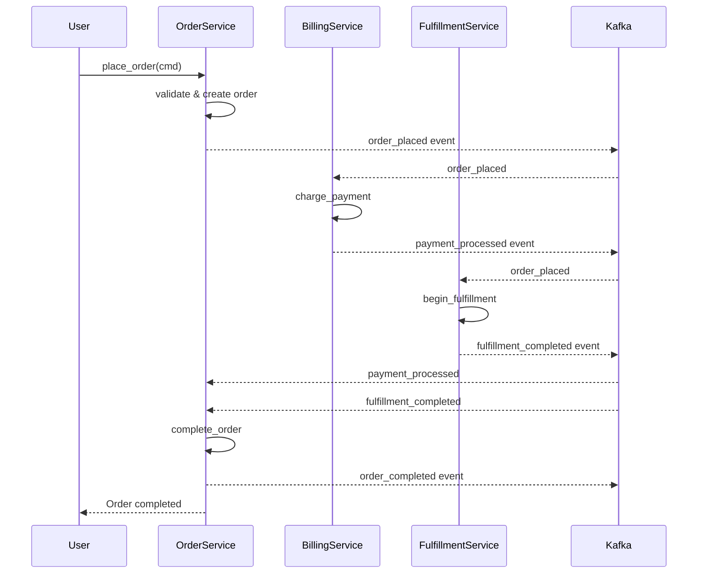

# Expert 9 Analysis: Distributed Systems Modeling with Formal Methods

> [!CAUTION]
> **PARTIALLY SUPERSEDED** — Formal methods syntax integrated into `@specforge/software` (RES-27), not a separate plugin. Zero-entity core (RES-26). The distributed systems modeling analysis remains valid.

**Expert:** Distributed Systems Architect
**Focus:** Microservices, Event-Driven Architecture, Service Choreography, CSP/DbC/B-Method
**Date:** March 4, 2026

---

## Executive Summary

SpecForge's existing entity model (events, ports, behaviors, libraries, deliverables) provides **80% of what's needed** to model distributed systems. The critical gap is **service boundary definition** and **communication topology specification**. CSP naturally models microservice choreography; DbC provides contract compatibility checking; B-Method enables stepwise refinement from abstract service specs to concrete implementations.

**Key Recommendation:** Add a new `service` entity to core (or `@specforge/platform` plugin) to model service boundaries, deployment topology, and inter-service communication patterns. Everything else is already present or easily derivable.

---

## 1. CSP as Microservice Choreography Language

### 1.1 Current State: Events + Behaviors ≈ CSP Processes

SpecForge's `event` and `behavior` entities already map naturally to CSP:

| SpecForge Concept | CSP Equivalent | Semantics |
|-------------------|----------------|-----------|
| `event` with `channel` | CSP channel `c!v` / `c?x` | Synchronous message passing on named channel |
| `behavior` with `produces` | CSP output process `P = c!v → P'` | Process sends event on channel, continues as P' |
| `event` with `consumers` | CSP input process `Q = c?x → Q'` | Process receives event from channel, continues as Q' |
| Multiple consumers | CSP parallel composition `P \|\| Q \|\| R` | Multiple processes synchronize on channel |
| Event payload | CSP message value | Data carried in the communication |

**Example Mapping:**

```spec
event order_placed "Order Placed" {
  trigger   place_order
  channel   "orders.placed"
  payload   { orderId string, customerId string, amount number }
  consumers [charge_payment, begin_fulfillment, send_confirmation]
}
```

**CSP Process Algebra:**

```csp
-- Producer process
PLACE_ORDER = place_order?orderId?customerId?amount →
              orders_placed!orderId!customerId!amount →
              PLACE_ORDER

-- Consumer processes (parallel composition)
CHARGE_PAYMENT = orders_placed?orderId?customerId?amount →
                 payment_processed!orderId → CHARGE_PAYMENT

BEGIN_FULFILLMENT = orders_placed?orderId?customerId?amount →
                    fulfillment_started!orderId → BEGIN_FULFILLMENT

SEND_CONFIRMATION = orders_placed?orderId?customerId?amount →
                    confirmation_sent!customerId → SEND_CONFIRMATION

-- System composition
SYSTEM = PLACE_ORDER ||| (CHARGE_PAYMENT ||| BEGIN_FULFILLMENT ||| SEND_CONFIRMATION)
```

### 1.2 Mapping Events to Message Broker Topology

SpecForge events with `channel` fields map directly to message broker primitives:

| Message Broker | Channel Mapping | Semantics |
|----------------|-----------------|-----------|
| **Kafka** | `channel` → topic name | `"orders.placed"` → Kafka topic `orders.placed` |
| **NATS** | `channel` → subject name | `"orders.placed"` → NATS subject `orders.placed` |
| **RabbitMQ** | `channel` → exchange.routing-key | `"orders.placed"` → exchange `events` + key `orders.placed` |
| **AWS SNS/SQS** | `channel` → SNS topic ARN | `"orders.placed"` → SNS topic `arn:aws:sns:...` |
| **Azure Service Bus** | `channel` → topic name | `"orders.placed"` → Service Bus topic `orders.placed` |

**Code Generation Opportunity:**

From the `event` entity above, generate Kafka producer/consumer config:

```yaml
# kafka-topics.yaml (generated from events/*.spec)
topics:
  - name: orders.placed
    partitions: 6
    replication-factor: 3
    retention-ms: 604800000  # 7 days
    producers:
      - service: order-service
        behavior: place_order
    consumers:
      - service: billing-service
        behavior: charge_payment
      - service: fulfillment-service
        behavior: begin_fulfillment
      - service: notification-service
        behavior: send_confirmation
```

### 1.3 CSP Channel Types and Event Patterns

SpecForge events can model various CSP communication patterns by adding optional `pattern` field:

| Pattern | CSP Semantics | Distributed Equivalent | Example |
|---------|---------------|------------------------|---------|
| `pub_sub` (default) | `c!v \|\| c?x \|\| c?y` | One producer, many consumers (broadcast) | `order_placed` → 3 consumers |
| `point_to_point` | `c!v → c?x` | One producer, one consumer (direct channel) | `user_created` → `send_welcome_email` |
| `request_reply` | `c!req → reply?resp` | Synchronous RPC (two channels) | `validate_payment` ↔ `payment_validated` |
| `fan_out` | `c!v → (c1!v \|\| c2!v \|\| c3!v)` | Scatter to partitions | `batch_process` → worker pool |

**Proposed Extension:**

```spec
event order_placed "Order Placed" {
  trigger   place_order
  channel   "orders.placed"
  pattern   pub_sub           # NEW: explicit pattern
  payload   { orderId string, customerId string, amount number }
  consumers [charge_payment, begin_fulfillment, send_confirmation]
}

event validate_payment "Payment Validation Request" {
  trigger   charge_payment
  channel   "payment.validate"
  pattern   request_reply     # NEW: RPC-style
  reply_channel "payment.validated"
  payload   { orderId string, amount number }
  consumers [payment_gateway_adapter]
}
```

### 1.4 Service Boundaries: The Missing Piece

**Current Problem:** Events and behaviors exist in a flat namespace. There's no way to say "these 5 behaviors belong to the `order-service`, and these 3 behaviors belong to the `billing-service`."

**Proposed Solution:** Add a `service` entity (core or `@specforge/platform` plugin).

```spec
service order_service "Order Service" {
  behaviors [place_order, cancel_order, query_order]
  libraries [order_lib]
  produces  [order_placed, order_cancelled]
  consumes  [payment_processed, fulfillment_completed]
  ports     [OrderRepository, OrderEventBus]

  deployment {
    type       container
    replicas   3
    autoscale  { min: 2, max: 10, cpu: 70 }
  }
}

service billing_service "Billing Service" {
  behaviors [charge_payment, refund_payment]
  libraries [billing_lib, payment_gateway_lib]
  produces  [payment_processed, payment_failed]
  consumes  [order_placed, order_cancelled]
  ports     [PaymentRepository, PaymentGateway]
}
```

**CSP Process Algebra for Services:**

```csp
-- Service as a labeled process
ORDER_SERVICE =
  place_order?cmd → orders_placed!event → ORDER_SERVICE
  [] cancel_order?cmd → orders_cancelled!event → ORDER_SERVICE
  [] payment_processed?event → update_order!cmd → ORDER_SERVICE

BILLING_SERVICE =
  orders_placed?event → charge_payment!cmd → payment_processed!event → BILLING_SERVICE
  [] orders_cancelled?event → refund_payment!cmd → BILLING_SERVICE

-- System-level composition
DISTRIBUTED_SYSTEM = ORDER_SERVICE [| {orders_placed, orders_cancelled, payment_processed} |] BILLING_SERVICE
```

---

## 2. Deadlock Detection in Service Communication Graphs

### 2.1 CSP Failures Model and Deadlock Freedom

CSP provides **deadlock detection** through the **failures model**. A process `P` is **deadlock-free** if it never reaches a state where no actions are possible.

**Deadlock Scenarios in Microservices:**

1. **Circular wait on synchronous calls**: Service A calls B, B calls C, C calls A
2. **Event dependency cycles**: Event E1 triggers behavior B1, which produces E2, which triggers B2, which produces E1
3. **Resource starvation**: All instances of service A waiting for service B, all instances of B waiting for A

**SpecForge Graph Analysis:**

The compiler can detect deadlock scenarios by analyzing the event consumption graph:

```
order_placed → charge_payment → payment_processed → complete_order → order_completed
                    ↓
            payment_failed → cancel_order → order_cancelled
                                  ↓
                            refund_payment → refund_processed
```

**Deadlock Detection Algorithm:**

1. Build a directed graph where:
   - Nodes = behaviors
   - Edges = event dependencies (`behavior produces event → event consumed by behavior`)
2. Check for **strongly connected components** (SCCs) with size > 1
3. Analyze each SCC:
   - **Safe**: SCC contains at least one async/non-blocking behavior
   - **Deadlock risk**: All behaviors in SCC are sync/blocking

**Proposed Validation Code:**

| Code | Rule | Example |
|------|------|---------|
| **W019** | **Potential deadlock in event flow** | Circular dependency: `order_placed → charge_payment → payment_processed → complete_order → order_placed` |
| **E017** | **Guaranteed deadlock** | Two services both make synchronous calls to each other with no timeout |

### 2.2 CSP Refinement Checking with FDR

The **Failures-Divergences Refinement (FDR)** tool can mechanically verify deadlock freedom.

**Integration Strategy:**

1. Generate CSP process algebra from SpecForge `.spec` files
2. Run FDR checker on generated CSP
3. Report deadlock traces back to user in SpecForge diagnostic format

**Example FDR Check:**

```csp
-- Generated from spec/events/*.spec
assert DISTRIBUTED_SYSTEM :[deadlock free [F]]
```

If FDR finds a deadlock, report:

```
error[E017]: Deadlock detected in event flow
  ┌─ events/order.spec:12:15
  │
12│   consumers [charge_payment]
  │              ^^^^^^^^^^^^^^ This behavior produces payment_processed
  │
  ┌─ events/payment.spec:8:15
  │
 8│   consumers [complete_order]
  │              ^^^^^^^^^^^^^^ This behavior produces order_completed
  │
  ┌─ events/order.spec:22:15
  │
22│   consumers [charge_payment]
  │              ^^^^^^^^^^^^^^ Circular dependency detected
  │
  = note: CSP trace: order_placed → charge_payment → payment_processed → complete_order → order_completed → charge_payment
  = help: Break the cycle by making one of these behaviors async or adding a timeout
```

### 2.3 Live vs. Safe Systems (CSP Safety/Liveness)

CSP distinguishes between:

- **Safety**: "Bad things never happen" (e.g., no duplicate payment)
- **Liveness**: "Good things eventually happen" (e.g., order eventually completes)

**Mapping to SpecForge:**

| SpecForge Concept | CSP Property | Validation Strategy |
|-------------------|--------------|---------------------|
| `invariant` | Safety property | Property-based testing + runtime assertions |
| `event` with `consumers` | Liveness property | Message delivery guarantees + consumer health checks |
| `behavior` with `contract` | Both safety and liveness | Contract = safety, `verify` = liveness |

**Example Liveness Property:**

```spec
invariant order_eventually_completes {
  risk      high
  rationale """
    Every order_placed event MUST eventually result in either
    order_completed or order_cancelled. No orders stuck in limbo.
  """
  enforced_by [complete_order, cancel_order]
}
```

CSP liveness check (FDR):

```csp
-- Every order_placed event eventually leads to completion
assert DISTRIBUTED_SYSTEM ⊑ (orders_placed → (order_completed ⊓ order_cancelled))
```

---

## 3. Contract Compatibility Between Services (DbC for API Boundaries)

### 3.1 Design by Contract at Service Boundaries

DbC's **precondition/postcondition** model maps perfectly to microservice APIs:

| DbC Concept | Microservice Equivalent | SpecForge Entity |
|-------------|-------------------------|------------------|
| Precondition | Request validation (schema, auth, rate limits) | `behavior` contract "When valid X received..." |
| Postcondition | Response guarantee (status, data shape) | `behavior` contract "MUST return Result<T, E>" |
| Invariant | Cross-request consistency | `invariant` entity |
| Class invariant | Service-level data consistency | `invariant` enforced by service's behaviors |

### 3.2 Consumer-Driven Contracts (Pact Model)

SpecForge's `port` entity naturally models **consumer-driven contracts**:

**Current Port Model:**

```spec
port OrderAPI {
  direction inbound
  category  "api/order"

  method createOrder(cmd: CreateOrderCommand) -> Result<Order, InvalidOrderError>
  method getOrder(id: string) -> Result<Order, OrderNotFoundError>
}
```

**Enhanced with Consumer Contracts:**

```spec
port OrderAPI {
  direction inbound
  category  "api/order"

  method createOrder(cmd: CreateOrderCommand) -> Result<Order, InvalidOrderError>
  method getOrder(id: string) -> Result<Order, OrderNotFoundError>

  # NEW: explicit consumers and their expected contracts
  consumers {
    billing_service {
      uses    [createOrder, getOrder]
      expects {
        createOrder: "orderId returned is UUID v4"
        getOrder:    "200 status or 404, never 500"
      }
    }
    fulfillment_service {
      uses    [getOrder]
      expects {
        getOrder: "includes items[] field with SKUs"
      }
    }
  }
}
```

**Validation Strategy:**

1. Each consumer service declares its expectations in its own `.spec` files
2. Provider service's `specforge check` validates it meets all consumer contracts
3. Break a contract → **E018: Contract violation detected**

**Example Diagnostic:**

```
error[E018]: Contract violation: OrderAPI.getOrder
  ┌─ ports/order-api.spec:15:10
  │
15│   method getOrder(id: string) -> Result<Order, OrderNotFoundError>
  │          ^^^^^^^^ This method's response type changed
  │
  = note: Consumer 'fulfillment_service' expects field 'items[]' in Order type
  = note: Current Order type does not include 'items' field
  │
  ┌─ types/order.spec:8:1
  │
 8│ type Order {
  │      ^^^^^ Missing field: items[]
  │
  = help: Add 'items OrderItem[]' field to Order type or update consumer contract
```

### 3.3 Liskov Substitution Principle for Service Evolution

DbC's **subtyping rules** (LSP) ensure **backward compatibility**:

- Preconditions can only be **weakened** (accept more inputs)
- Postconditions can only be **strengthened** (return more specific outputs)

**SpecForge Port Evolution:**

```spec
# Version 1 (old)
port OrderAPI {
  method getOrder(id: string) -> Result<Order, OrderNotFoundError>
}

# Version 2 (backward compatible)
port OrderAPI {
  method getOrder(id: string) -> Result<Order, OrderNotFoundError | RateLimitError>
  #                                            ^^^^^^^^^^^^^^^^^ NEW error type
}
```

**Validation:**

```
error[E019]: Breaking change in port method signature
  ┌─ ports/order-api.spec:15:50
  │
15│   method getOrder(id: string) -> Result<Order, OrderNotFoundError | RateLimitError>
  │                                                                      ^^^^^^^^^^^^^^ New error type breaks contract
  │
  = note: Adding error types is a breaking change for consumers
  = help: Introduce a new method 'getOrderV2' or version the port interface
```

### 3.4 Service Contract Testing with SpecForge

**Integration with Pact/Spring Cloud Contract:**

```spec
behavior create_order "Create Order" {
  invariants [order_idempotency]
  ports      [OrderAPI]

  contract """
    When a valid CreateOrderCommand is received,
    the system MUST create an order with a unique orderId
    and MUST return Result<Order, InvalidOrderError>.

    Response MUST include orderId (UUID v4), items[], totalAmount.
  """

  # Contract tests generated for consumers
  verify contract "billing_service expects orderId UUID v4"
  verify contract "fulfillment_service expects items[] with SKUs"

  # Provider contract test
  verify integration "POST /orders with valid payload returns 201 + Order"
}
```

**Code Generation:** Generate Pact contract files from behavior contracts.

---

## 4. Refinement of Abstract Service Specs to Concrete Implementations (B-Method)

### 4.1 B-Method Abstract Machines → SpecForge Services

B-Method's **abstract machine notation (AMN)** models state + operations with refinement steps.

**Mapping:**

| B-Method Concept | SpecForge Equivalent | Example |
|------------------|----------------------|---------|
| Abstract Machine | `service` (abstract spec) | `service OrderService { ... }` |
| State Variables | `type` with `@state` annotation | `type OrderState { status: OrderStatus }` |
| Operations | `behavior` with preconditions | `behavior place_order { contract "..." }` |
| Invariants | `invariant` entity | `invariant order_idempotency` |
| Refinement | Versioned services or implementation | `service OrderServiceImpl implements OrderService` |

### 4.2 Stepwise Refinement Example: Order Service

**Abstract Specification (Level 0):**

```spec
service OrderService "Order Service (Abstract)" {
  behaviors [place_order, cancel_order]

  invariants [
    order_idempotency,
    no_duplicate_orders,
    cancel_only_pending_orders
  ]
}

invariant order_idempotency {
  risk      high
  rationale """
    Placing the same order twice MUST NOT create duplicate orders.
    OrderId MUST be unique across all orders.
  """
}

behavior place_order "Place Order (Abstract)" {
  contract """
    Given a CreateOrderCommand with customerId and items[],
    MUST create an order with status PENDING.
    MUST NOT create order if items[] is empty.
  """
}
```

**Refined Specification (Level 1): Add Event-Driven Choreography**

```spec
service OrderService "Order Service (Event-Driven)" {
  behaviors [place_order, cancel_order, complete_order]
  produces  [order_placed, order_cancelled, order_completed]
  consumes  [payment_processed, fulfillment_completed]

  invariants [
    order_idempotency,
    no_duplicate_orders,
    cancel_only_pending_orders,
    order_state_machine  # NEW
  ]
}

invariant order_state_machine {
  rationale """
    Order status MUST follow the state machine:
    PENDING → PAYMENT_PENDING → FULFILLMENT_PENDING → COMPLETED
            ↘ CANCELLED (from any state except COMPLETED)
  """
}

event order_placed "Order Placed" {
  trigger   place_order
  channel   "orders.placed"
  consumers [charge_payment, log_audit]
}

event payment_processed "Payment Processed" {
  trigger   charge_payment
  channel   "billing.payment-processed"
  consumers [complete_order]
}
```

**Concrete Implementation (Level 2): Add Database and Messaging**

```spec
service OrderService "Order Service (Implementation)" {
  behaviors [place_order, cancel_order, complete_order]
  libraries [order_lib, kafka_lib, postgres_lib]
  ports     [OrderRepository, OrderEventBus]

  deployment {
    type       container
    image      "mycompany/order-service:1.2.0"
    replicas   3
    resources  { cpu: "500m", memory: "512Mi" }
  }
}

library order_lib "@myservice/order" {
  features     [order_management]
  depends_on   [kafka_lib, postgres_lib]
  ports_defined [OrderRepository, OrderEventBus]
}

port OrderRepository {
  direction outbound
  category  "persistence/order"

  method create(order: Order) -> Result<Order, DuplicateOrderError>
  method findById(id: string) -> Result<Order, OrderNotFoundError>
  method updateStatus(id: string, status: OrderStatus) -> Result<void, OrderNotFoundError>
}

port OrderEventBus {
  direction outbound
  category  "messaging/order"

  method publish(event: OrderEvent) -> Result<void, PublishError>
}
```

### 4.3 Refinement Validation Rules

B-Method requires proofs that each refinement step preserves correctness:

1. **Invariants must be preserved** across refinement levels
2. **Operations must satisfy the same preconditions/postconditions** (or stronger)
3. **New operations must not violate existing invariants**

**SpecForge Validation:**

| Code | Rule | Example |
|------|------|---------|
| **W020** | **Invariant weakened in refinement** | Abstract spec: "no duplicate orders", Refined spec: removed invariant |
| **E020** | **Contract violated in refinement** | Abstract behavior accepts all inputs, Refined behavior rejects some |
| **W021** | **Unreachable state in refined state machine** | Added `CANCELLED` state but no behavior transitions to it |

---

## 5. Event Flow Visualization: Generating Sequence Diagrams from CSP

### 5.1 CSP Process Traces → Mermaid Sequence Diagrams

CSP traces are sequences of events: `order_placed → charge_payment → payment_processed → complete_order`.

**Generation Algorithm:**

1. Parse event consumption graph from `events/*.spec`
2. Extract all possible traces (DFS/BFS)
3. Render as Mermaid sequence diagram

**Example:**

```spec
event order_placed {
  trigger   place_order
  consumers [charge_payment, begin_fulfillment]
}

event payment_processed {
  trigger   charge_payment
  consumers [complete_order]
}

event fulfillment_completed {
  trigger   begin_fulfillment
  consumers [complete_order]
}
```

**Generated Mermaid:**



**CLI Command:**

```bash
specforge diagram sequence order_placed
# → Generates sequence diagram starting from order_placed event
# → Outputs: docs/diagrams/order_placed-sequence.mmd
```

### 5.2 Interactive Trace Explorer

**LSP Integration:**

- Hover over `event` → show all consumers and sequence diagram preview
- Click on `behavior` → highlight all events it produces/consumes
- Right-click on `event` → "Trace event flow" → opens interactive diagram

---

## 6. New Entity Fields and Patterns for Distributed Systems

### 6.1 Proposed New Entity: `service`

**Purpose:** Model service boundaries, deployment topology, and inter-service communication.

```spec
service OrderService "Order Service" {
  # Behavior grouping
  behaviors [place_order, cancel_order, complete_order, query_order]

  # Code organization
  libraries [order_lib, shared_lib]

  # Communication contracts
  produces  [order_placed, order_cancelled, order_completed]
  consumes  [payment_processed, fulfillment_completed]

  # Infrastructure dependencies
  ports     [OrderRepository, OrderEventBus, PaymentGateway]

  # Deployment specification
  deployment {
    type       container
    image      "mycompany/order-service:1.2.0"
    replicas   3
    autoscale  { min: 2, max: 10, cpu: 70 }
    resources  { cpu: "500m", memory: "512Mi" }
  }

  # Observability
  observability {
    traces  true
    metrics ["order_created_total", "order_processing_duration"]
    logs    { level: "info", format: "json" }
  }

  # External references
  refs [gh.repo:mycompany/order-service, grafana.dashboard:order-service-metrics]
}
```

**Relationships:**

| From | To | Edge Type | Meaning |
|------|----|-----------|---------|
| `service` | `behavior` | `contains` | "This service implements these behaviors" |
| `service` | `library` | `built_from` | "This service uses these libraries" |
| `service` | `event` | `produces` | "This service produces these events" |
| `service` | `event` | `consumes` | "This service consumes these events" |
| `service` | `port` | `uses_port` | "This service depends on these ports" |
| `service` | `ref` | `links_to` | "This service links to these external references" |

**Validation Rules:**

| Code | Rule |
|------|------|
| **E021** | Service behavior not found — every behavior in `behaviors` must exist |
| **E022** | Service event mismatch — service claims to produce event but no behavior in service triggers it |
| **W022** | Orphan service — service not referenced by any deliverable |
| **W023** | Service consumes event from itself — potential coupling smell |

### 6.2 Enhanced `event` Entity Fields

**Add message broker semantics:**

```spec
event order_placed "Order Placed" {
  trigger   place_order
  channel   "orders.placed"
  pattern   pub_sub             # NEW: pub_sub | point_to_point | request_reply | fan_out

  # Message broker configuration
  broker {
    type          kafka
    partitions    6
    replication   3
    retention_ms  604800000  # 7 days
    key_by        "orderId"   # Partition key for ordering guarantees
  }

  # Delivery guarantees
  delivery {
    guarantee  at_least_once   # NEW: at_most_once | at_least_once | exactly_once
    timeout_ms 5000
    retries    3
  }

  payload {
    orderId     string
    customerId  string
    items       OrderItem[]
    totalAmount number
    timestamp   timestamp
  }

  consumers [charge_payment, begin_fulfillment, send_confirmation]

  # Schema evolution
  schema_version "1.2.0"
  backward_compatible true
}
```

### 6.3 Enhanced `behavior` Entity for Distributed Semantics

**Add idempotency, timeouts, and compensation:**

```spec
behavior place_order "Place Order" {
  invariants [order_idempotency]
  ports      [OrderRepository, OrderEventBus]

  contract """
    When a valid CreateOrderCommand is received,
    the system MUST create an order with a unique orderId
    and MUST return Result<Order, InvalidOrderError>.
  """

  # Distributed semantics
  distributed {
    idempotent      true           # NEW: Safe to retry
    timeout_ms      5000           # NEW: Operation timeout
    compensate_with cancel_order   # NEW: Saga compensation behavior
    circuit_breaker {
      failure_threshold 5
      timeout_duration  30000      # 30s
    }
  }

  verify unit        "create order with unique ID"
  verify integration "create order, service restarts, order persists"
  verify property    "concurrent creates with same ID → exactly one succeeds"
}
```

### 6.4 New `saga` Entity for Long-Running Transactions

**Purpose:** Model distributed transactions across services (saga pattern).

```spec
saga order_checkout_saga "Order Checkout Saga" {
  trigger   checkout_order

  # Saga steps (choreography or orchestration)
  steps {
    1. place_order       compensate_with cancel_order
    2. reserve_inventory compensate_with release_inventory
    3. charge_payment    compensate_with refund_payment
    4. begin_fulfillment compensate_with cancel_fulfillment
  }

  # Events in saga flow
  produces [
    order_placed,
    inventory_reserved,
    payment_processed,
    fulfillment_started,
    order_completed,
    order_checkout_failed
  ]

  # Failure handling
  on_failure {
    strategy rollback  # rollback | compensate | manual
    notify   [ops_team, customer_support]
  }

  invariants [saga_atomicity, saga_compensation_completeness]

  verify integration "successful saga completes all steps"
  verify integration "failure at step 3 triggers compensation for steps 1-2"
}

invariant saga_compensation_completeness {
  rationale """
    For every saga step, MUST exist a compensation behavior.
    If any step fails, ALL previous steps MUST be compensated.
  """
}
```

### 6.5 New `consistency` Entity for Eventual Consistency Models

**Purpose:** Declare eventual consistency boundaries and conflict resolution.

```spec
consistency user_profile_consistency "User Profile Consistency" {
  entities [User, UserSettings, UserProfile]

  # Consistency model
  model eventual_consistency  # strong | eventual | causal

  # Conflict resolution strategy
  conflict_resolution {
    strategy last_write_wins  # last_write_wins | merge | custom
    conflict_handler resolve_user_profile_conflict
  }

  # Convergence guarantees
  convergence {
    max_delay_ms   1000   # Max time for replicas to converge
    replicas       3
    quorum_reads   false
    quorum_writes  true
  }

  invariants [user_profile_eventually_consistent]
}

invariant user_profile_eventually_consistent {
  rationale """
    After a user profile update, all replicas MUST converge to the same
    value within 1000ms. During convergence window, reads MAY return
    stale data.
  """
}
```

### 6.6 Enhanced `port` Entity for Service Meshes

**Add circuit breaker, retry policies, and service mesh config:**

```spec
port PaymentGateway {
  direction outbound
  category  "external/payment"

  method charge(request: ChargeRequest) -> Result<ChargeResponse, PaymentError>

  # Service mesh configuration
  resilience {
    timeout_ms 5000
    retry {
      attempts    3
      backoff_ms  [100, 500, 2000]  # Exponential backoff
      idempotent  true
    }
    circuit_breaker {
      failure_threshold     5
      timeout_duration_ms   30000
      half_open_requests    1
    }
    rate_limit {
      requests_per_second 100
      burst               20
    }
  }

  # Observability
  tracing {
    span_name "payment_gateway.charge"
    tags      ["payment", "external"]
  }
}
```

---

## 7. Summary: What SpecForge Already Has vs. What's Missing

### 7.1 Already Present (80%)

| Concept | SpecForge Entity | Status |
|---------|------------------|--------|
| Event-driven communication | `event` with `channel` and `consumers` | ✅ Fully supported |
| Behavioral contracts | `behavior` with `contract` | ✅ Fully supported |
| API contracts | `port` with method signatures | ✅ Fully supported |
| Code organization | `library` with `depends_on` | ✅ Fully supported |
| Deployment artifacts | `deliverable` | ✅ Fully supported |
| Data shapes | `type` with fields | ✅ Fully supported |
| Invariants | `invariant` | ✅ Fully supported |
| Traceability chain | `deliverable → capability → feature → behavior → invariant` | ✅ Fully supported |
| External references | `ref` | ✅ Fully supported |

### 7.2 Missing (20%)

| Concept | Proposed Solution | Priority |
|---------|-------------------|----------|
| **Service boundaries** | New `service` entity | **CRITICAL** |
| **Message broker config** | Enhanced `event` entity with `broker` and `delivery` fields | **HIGH** |
| **Saga patterns** | New `saga` entity | **MEDIUM** |
| **Eventual consistency** | New `consistency` entity | **MEDIUM** |
| **Service mesh config** | Enhanced `port` entity with `resilience` block | **MEDIUM** |
| **Deadlock detection** | CSP graph analysis in compiler | **HIGH** |
| **Contract compatibility** | Consumer-driven contract validation in `port` | **HIGH** |
| **Sequence diagram generation** | `specforge diagram sequence` command | **LOW** (nice-to-have) |

---

## 8. Implementation Roadmap

### Phase 1: Service Boundaries (Critical)

**Goal:** Add `service` entity to model microservice boundaries.

- Add `service` entity to core or `@specforge/platform` plugin
- Fields: `behaviors`, `libraries`, `produces`, `consumes`, `ports`, `deployment`
- Validation: E021 (behavior not found), E022 (event mismatch), W022 (orphan service)
- Code generation: Docker Compose, Kubernetes manifests, Terraform

### Phase 2: Deadlock Detection (High)

**Goal:** Detect circular event dependencies and synchronous call cycles.

- Build event consumption graph from `events/*.spec`
- Detect strongly connected components (SCCs)
- Emit W019 (potential deadlock) for circular event flows
- (Optional) Integrate FDR checker for mechanical verification

### Phase 3: Contract Compatibility (High)

**Goal:** Consumer-driven contract validation.

- Add `consumers` block to `port` entity
- Validation: E018 (contract violation), E019 (breaking change)
- Integration: Generate Pact contract files from `behavior` contracts
- CLI: `specforge check contracts` subcommand

### Phase 4: Enhanced Event Semantics (Medium)

**Goal:** Message broker configuration and delivery guarantees.

- Add `broker`, `delivery`, `pattern` fields to `event` entity
- Code generation: Kafka topic config, NATS subject config, RabbitMQ exchange/queue
- Validation: W024 (event pattern mismatch)

### Phase 5: Sagas and Eventual Consistency (Medium)

**Goal:** Model distributed transactions and conflict resolution.

- Add `saga` entity with `steps`, `on_failure` fields
- Add `consistency` entity with `model`, `conflict_resolution` fields
- Validation: saga atomicity, compensation completeness

### Phase 6: Visualization (Low)

**Goal:** Generate sequence diagrams from event flows.

- `specforge diagram sequence <event_id>` command
- Output: Mermaid `.mmd` files
- LSP integration: hover over event → show diagram preview

---

## 9. Code Generation Examples

### 9.1 Kafka Topic Configuration

**From:**

```spec
event order_placed {
  channel   "orders.placed"
  broker {
    type          kafka
    partitions    6
    replication   3
    retention_ms  604800000
    key_by        "orderId"
  }
}
```

**Generate:**

```yaml
# kafka-topics.yaml
topics:
  - name: orders.placed
    partitions: 6
    replication-factor: 3
    retention-ms: 604800000
    config:
      cleanup.policy: delete
      compression.type: snappy
```

### 9.2 Service Mesh Resilience Config

**From:**

```spec
port PaymentGateway {
  resilience {
    timeout_ms 5000
    circuit_breaker {
      failure_threshold 5
      timeout_duration_ms 30000
    }
  }
}
```

**Generate (Istio):**

```yaml
# istio-virtual-service.yaml
apiVersion: networking.istio.io/v1beta1
kind: VirtualService
metadata:
  name: payment-gateway
spec:
  http:
    - route:
        - destination:
            host: payment-gateway
      timeout: 5s
      retries:
        attempts: 3
        perTryTimeout: 2s
---
apiVersion: networking.istio.io/v1beta1
kind: DestinationRule
metadata:
  name: payment-gateway
spec:
  host: payment-gateway
  trafficPolicy:
    outlierDetection:
      consecutiveErrors: 5
      interval: 30s
      baseEjectionTime: 30s
```

### 9.3 Kubernetes Service Deployment

**From:**

```spec
service OrderService {
  deployment {
    type       container
    image      "mycompany/order-service:1.2.0"
    replicas   3
    autoscale  { min: 2, max: 10, cpu: 70 }
    resources  { cpu: "500m", memory: "512Mi" }
  }
}
```

**Generate:**

```yaml
# k8s-order-service.yaml
apiVersion: apps/v1
kind: Deployment
metadata:
  name: order-service
spec:
  replicas: 3
  selector:
    matchLabels:
      app: order-service
  template:
    metadata:
      labels:
        app: order-service
    spec:
      containers:
        - name: order-service
          image: mycompany/order-service:1.2.0
          resources:
            requests:
              cpu: 500m
              memory: 512Mi
            limits:
              cpu: 1000m
              memory: 1Gi
---
apiVersion: autoscaling/v2
kind: HorizontalPodAutoscaler
metadata:
  name: order-service-hpa
spec:
  scaleTargetRef:
    apiVersion: apps/v1
    kind: Deployment
    name: order-service
  minReplicas: 2
  maxReplicas: 10
  metrics:
    - type: Resource
      resource:
        name: cpu
        target:
          type: Utilization
          averageUtilization: 70
```

---

## 10. Conclusion

SpecForge's existing entity model provides a **strong foundation** for distributed systems modeling. The event/behavior/port/library entities map naturally to CSP processes, DbC contracts, and microservice patterns.

**Critical additions:**

1. **`service` entity** — models service boundaries, deployment topology, and inter-service communication (closes the biggest gap)
2. **Deadlock detection** — CSP graph analysis in the compiler (W019/E017 validation codes)
3. **Contract compatibility** — consumer-driven contracts in `port` entity (E018/E019 validation codes)
4. **Enhanced event semantics** — message broker config and delivery guarantees

**Optional enhancements:**

5. **`saga` entity** — distributed transaction orchestration
6. **`consistency` entity** — eventual consistency models and conflict resolution
7. **Sequence diagram generation** — `specforge diagram sequence` command

With these additions, SpecForge becomes a **complete formal specification system for distributed systems**, bridging the gap between abstract service design and concrete microservice implementation.

---

## References

- **CSP Research:** `/Users/u1070457/Projects/Perso/specforge/research-csp.md`
- **Design by Contract Research:** `/Users/u1070457/Projects/Perso/specforge/research-design-by-contract.md`
- **B-Method Research:** `/Users/u1070457/Projects/Perso/specforge/research-b-method.md`
- **SpecForge Entity Model:** `/Users/u1070457/Projects/Perso/specforge/docs/entity-model.md`
- **Event Entity Docs:** `/Users/u1070457/Projects/Perso/specforge/docs/entities/event.md`
- **Port Entity Docs:** `/Users/u1070457/Projects/Perso/specforge/docs/entities/port.md`
- **Behavior Entity Docs:** `/Users/u1070457/Projects/Perso/specforge/docs/entities/behavior.md`
- **Library Entity Docs:** `/Users/u1070457/Projects/Perso/specforge/docs/entities/library.md`
- **Deliverable Entity Docs:** `/Users/u1070457/Projects/Perso/specforge/docs/entities/deliverable.md`
